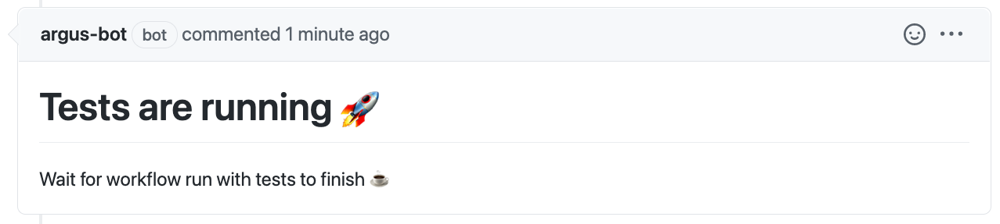
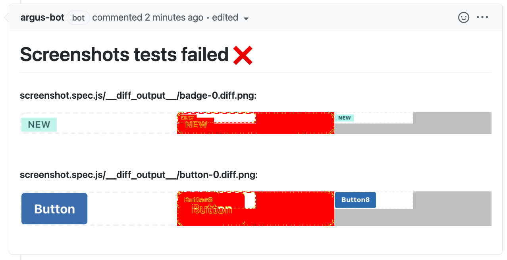
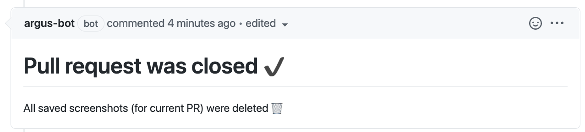

# Argus
**Argus** is a GitHub App built with [Probot](https://github.com/probot/probot)
to watch for repository's workflows with tests, download artifacts with screenshots differences images,
and pin these images to bot's comment of pull request.

> **Why "Argus"?** Argus is a many-eyed  "all-seeing" giant in Greek mythology.
> This character is known for having generated the saying "the eyes of Argus"
> (being subject to strict scrutiny in one's actions to an invasive, distressing degree).
> [(c) Wikipedia](https://en.wikipedia.org/wiki/Argus_Panoptes)

## What bot can do? :bulb:
- Holds first PR comment.
All workflow updates edit already existing bot comment.
No endless stream of comments from bot!
- Sets loading state comment when PR is opened or new commits are pushed to PR.

- Downloads artifacts from workflow with tests, finds screenshots diffs images, and pins them to the tests failure report.

- Removes all uploaded images (for current PR) after closing pull request.


## Setup :rocket:
You can deploy your own bot using this code
or use already hosted **[lumberjack-bot](https://github.com/apps/lumberjack-bot)**.

>We actively use **lumberjack-bot** in our UI Kit library [Taiga UI](https://github.com/TinkoffCreditSystems/taiga-ui).
It watches our taiga-components, and it can keep track of your repository too.
Do not hesitate to integrate it in your project's development.

To begin using bot:
- [Invite](https://github.com/apps/lumberjack-bot/installations/new) him to you repo.
- See its [configurable params](#bot-configurations-gear) or use default ones.

## Bot configurations :gear:
Bot has configurable params which can be unique for every Github repository.<br>
Every param is optional, and you can skip this section if default configuration satisfies you.

To pass custom params for bot you should create `bot-configs.toml` file in the root directory of repository.

**Example of `bot-configs.toml` file content** (you can paste it as it is) and **default values** of each param:
```yaml
# array of regular expression strings to match workflow names
# which should be watched by bot
workflowWithTests = [
  '.*screenshot.*', # all workflows with sub-string "screenshot" in their names will be watched by bot 
]

# array of RegExp strings to match images inside artifacts (by their path or file name)
# which shows difference between two screenshot and which will be added to bot report comment
screenshotsDiffsPaths = [
  '.*__diff_output__.*', # it is default cypress folder name into which snapshot diffs are put
]

# More configurable params will be added soon (if necessary)
```

## About Permissions :closed_lock_with_key:
At the beginning of the bot's installation it asks for some permissions.<br>
All of them are really needed, and we do not ask for more permissions than necessary.

#### Permissions
Bot requires the following repository's **permissions**:
- `actions: read` - to get list of workflow run artifacts and download these artifacts.
- `contents: write` - to create new branch for storage of screenshot diffs images
and to ability to upload/delete these screenshot diffs images.
- `metadata: read` - mandatory for Github App.
- `pull_requests: write` - to create/edit PR's comment with bot's tests reports.

#### Events
Bot listens to the following repository's **events**:
- `pull_request` — bot listens to pull request closing to delete all saved screenshots for current closed PR.
- `workflow_run` — bot listens to workflow completion to download artifacts and send tests report as PR comment.

## Contributing
If you have suggestions for how bot could be improved, or want to report a bug, open an issue!
We'd love all and any contributions.

For more, check out the [Contributing Guide](CONTRIBUTING.md).

## License

[ISC](LICENSE) © 2021 Barsukov Nikita <nikita.s.barsukov@gmail.com>
